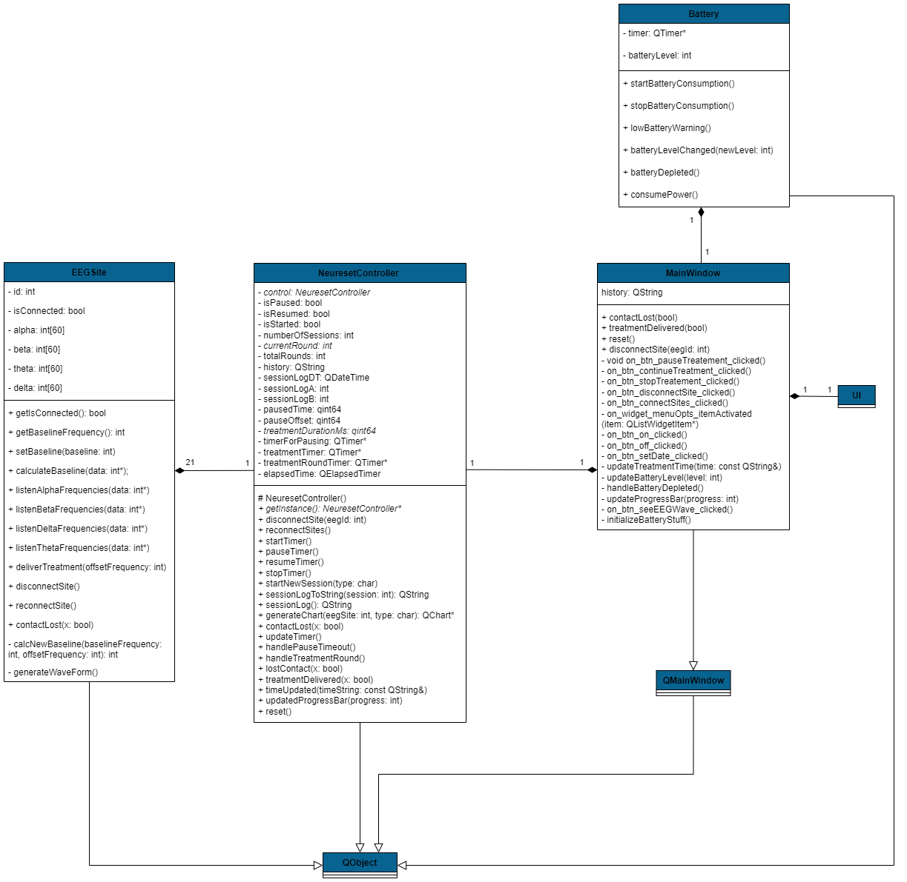
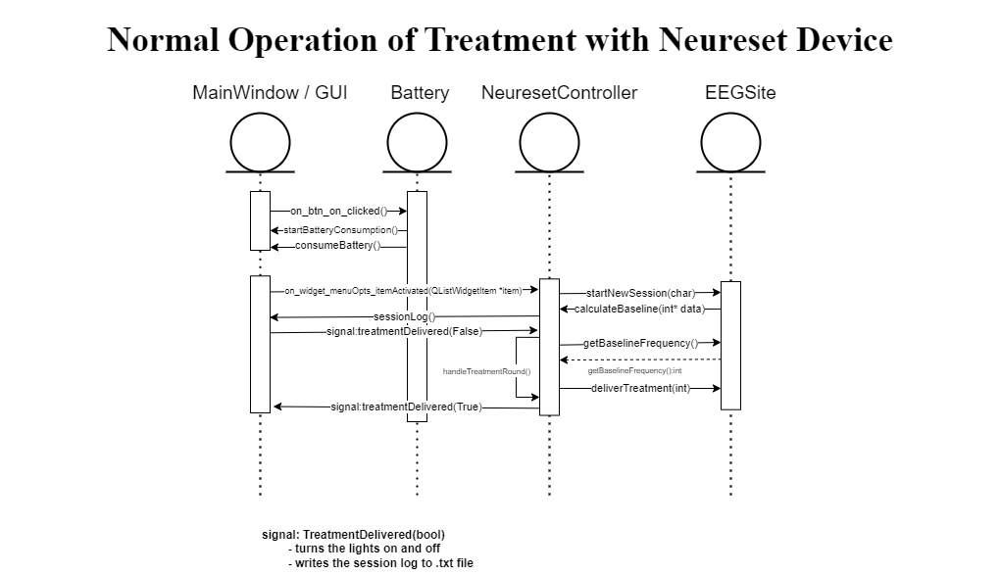
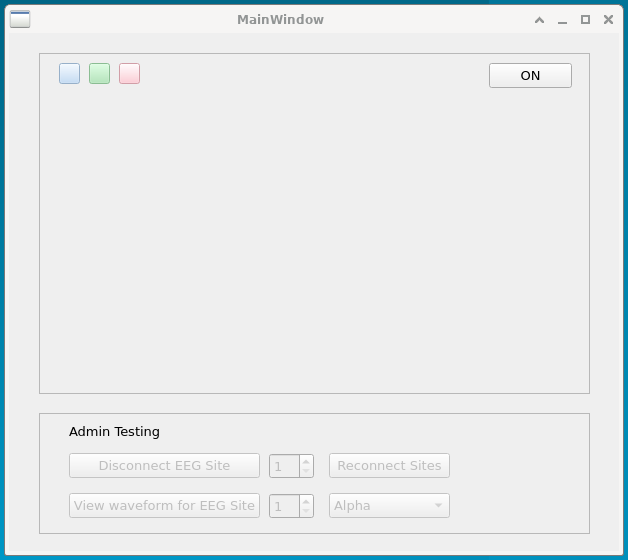
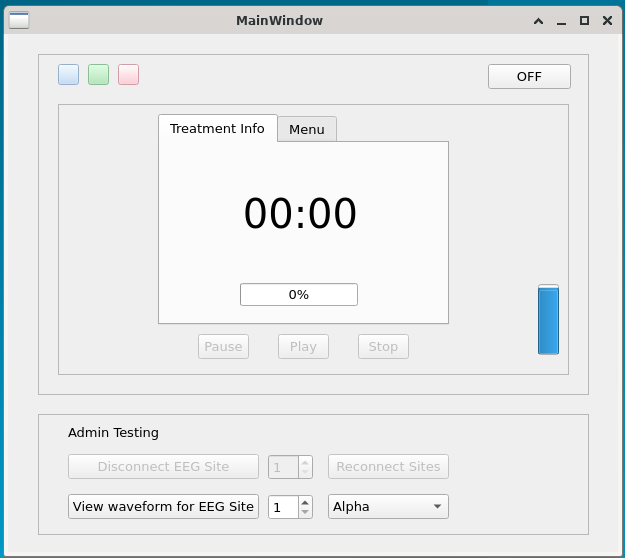
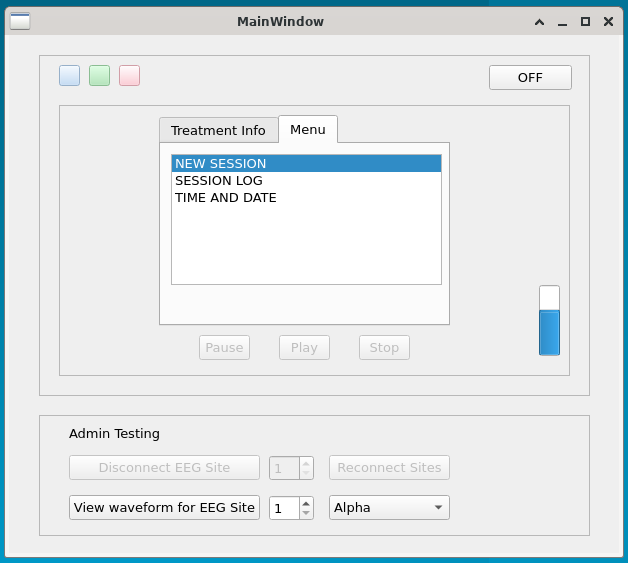

# Final Project Documentation

Preview on Vs Code or GitHub for best viewing experience  

## UML Class Diagrams

UMLDiagrams/UMLClassDiagram.png

## Sequence Diagrams

### 1 - Normal operation of treatment with Neureset device

UMLDiagrams/SequenceDiagrams/normal_operation_treatment.png

### 2 - Therapy history viewing with PC

UMLDiagrams/SequenceDiagrams/Therapy_history_viewing_with_PC.png

### 3 - Battery low response of the device

UMLDiagrams/SequenceDiagrams/battery_low_response_of_the_device.png

### 4 - Connection loss between electrodes and the device

UMLDiagrams/SequenceDiagrams/connection_loss_between_electrodes_and_the_device.png

## State Diagrams

### State Diagram for

UMLDiagrams/StateDiagrams/StateDiagram.png

### State Diagram for Controller

UMLDiagrams/StateDiagrams/StateDiagramController.png

## Requirements Traceability matrix

UMLDiagrams/Traceability_Matrix.pdf

## Use Cases

UMLDiagrams/Use_Cases.pdf

## GUI

UMLDiagrams/GUI1.jpg

UMLDiagrams/GUI2.jpg

UMLDiagrams/GUI3.jpg

UMLDiagrams/GUI4.jpg

## Files

### Header Files

Battery.h  
EEGSite.h  
NeuresetController.h  
defs.h  
mainwindow.h

### cpp files

Battery.cpp  
EEGSite.cpp  
NeuresetController.cpp  
main.cpp  
mainwindow.cpp  

### Other Files

mainwindow.ui  
readMe.md  
Neureset.pro.user  
Neureset.pro  

## Video
<!-- Can be renamed -->
NeurosetDemo.mp4  
<video controls src="video.mp4" title="Title"></video>
