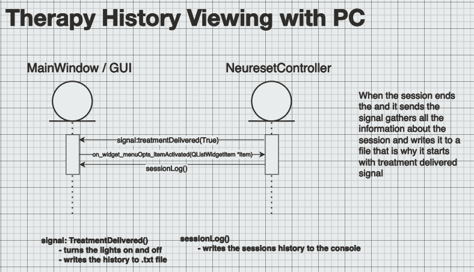
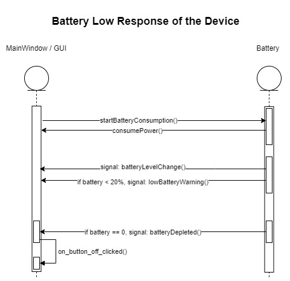
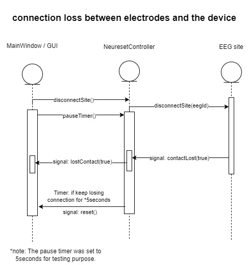
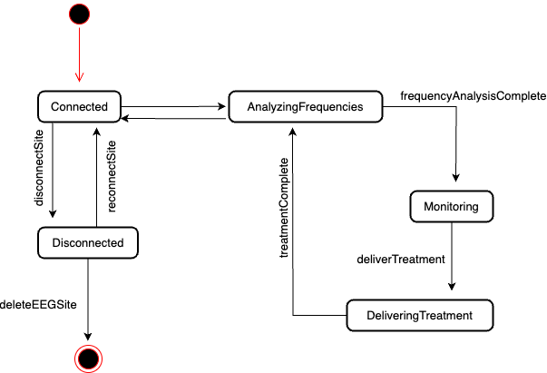
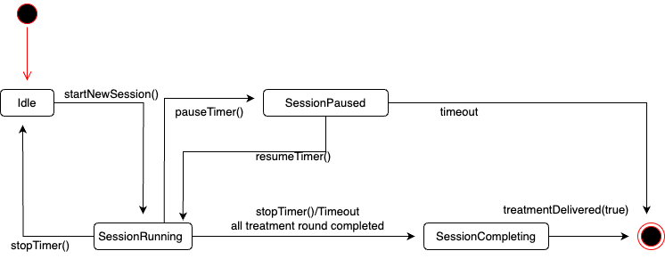
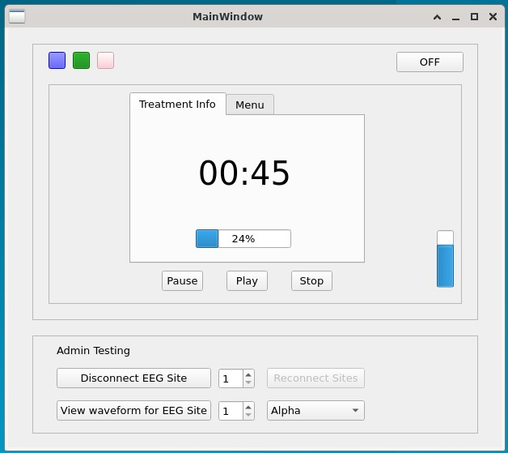

# Final Project Documentation

Preview on Vs Code or GitHub for best viewing experience  

## UML Class Diagrams

UMLDiagrams/UMLClassDiagram.png

## Sequence Diagrams

### 1 - Normal operation of treatment with Neureset device

UMLDiagrams/SequenceDiagrams/normal_operation_treatment.png

### 2 - Therapy history viewing with PC

UMLDiagrams/SequenceDiagrams/session_history_viewing.png

### 3 - Battery low response of the device

UMLDiagrams/SequenceDiagrams/battery_low_response.jpg

### 4 - Connection loss between electrodes and the device

UMLDiagrams/SequenceDiagrams/connection_loss.jpg

## State Diagrams

### State Diagram for EEG Site

UMLDiagrams/StateDiagrams/StateDiagram.png

### State Diagram for Controller

UMLDiagrams/StateDiagrams/StateDiagramController.png

## Requirements Traceability matrix

[Traceability_Matrix.pdf](Traceability_Matrix.pdf)

## Use Cases

[Use_cases.pdf](Use_cases.pdf)

## Design Decisions TODO

[Design_Decisions.pdf](Design_Decisions.pdf)

## GUI

UMLDiagrams/GUI1.jpg

UMLDiagrams/GUI2.jpg

UMLDiagrams/GUI3.jpg

UMLDiagrams/GUI4.jpg

## Video
https://www.youtube.com/watch?v=nU5daDI3iPI
